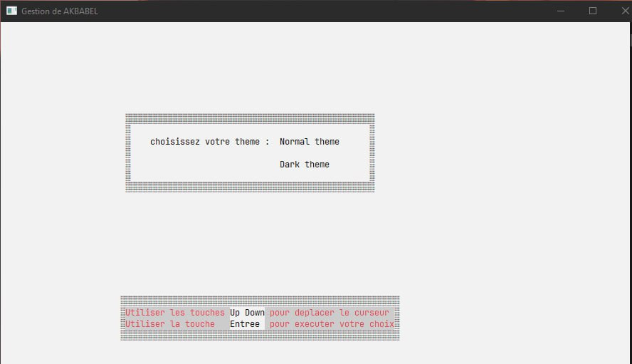
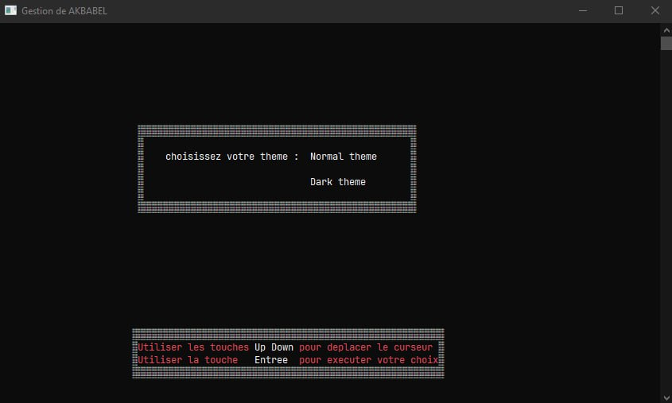
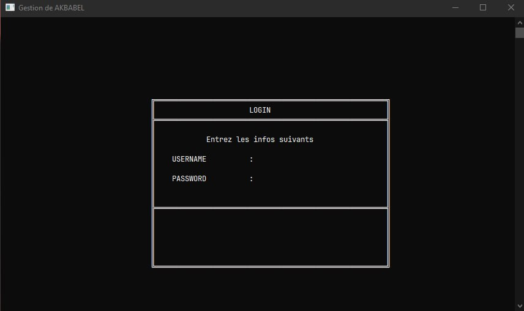
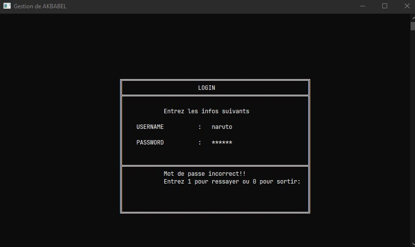
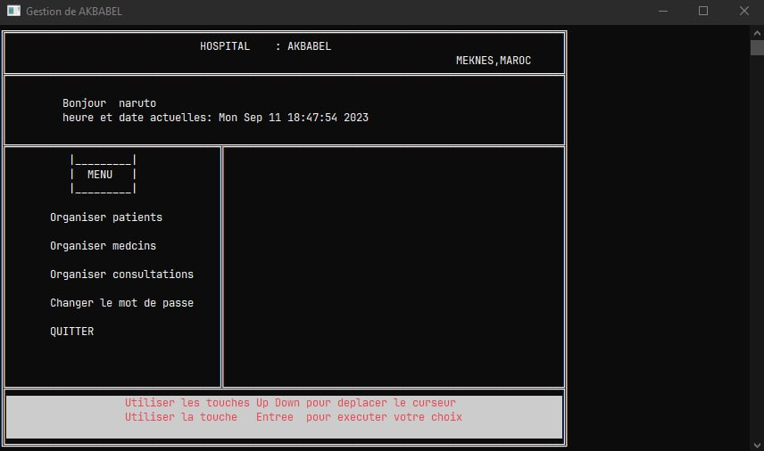
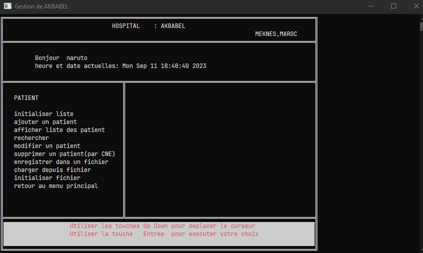
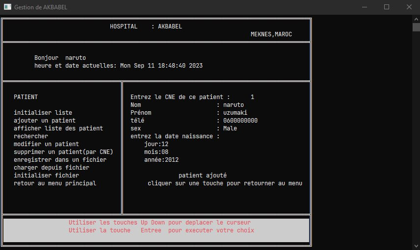

# AKBABEL HOSPTAL PROJECT USING C

## Description

This project is a hospital management system that is built using C programming language. Apparently this is my first project ever and I found it while scrolling on my old hard drive, This project is built for the purpose of completing the final project of the C programming language.
we use the concept of linked list and files handling in addition to the concept of graphics in C programming language.

## How to run

1. Clone this repository
2. Open the project in your favorite IDE & build/run the project
3. Or you can run the executable file  `GESTION_AKBABEL.exe` 
4. You will be asked to enter the password, the password is `narutoo`
5. Enjoy 

## Features

1. Manage patients
2. Manage doctors
3. Manage consultations

for each feature you can add, edit, delete, search, and view all the data.

## Screenshots

+ Light mode

+ Dark mode

+ Login

+ Login echec

+ Dashboard

+ Doctor page

+ Add patient

And the same for the other features you can view more on demo video.

## Demo video

https://github.com/ayoub-aknoun-edu/hospital_system_in_C/assets/81885138/c2a6bb7e-1761-4b95-866c-f98ea9678ac9

## Contributors

